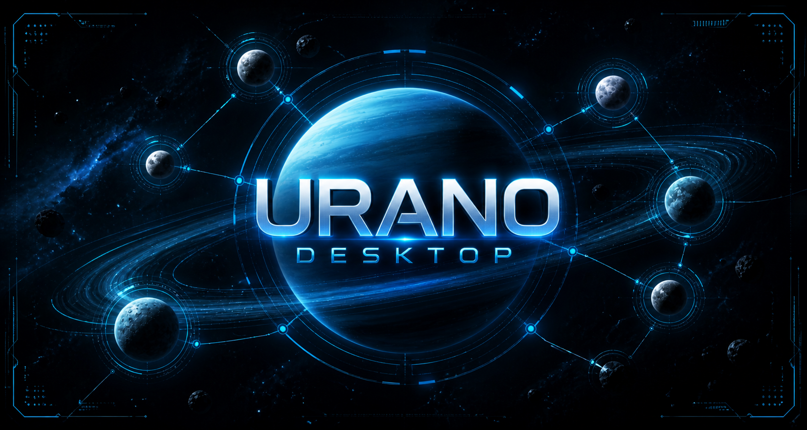

  
  <h1>Urano Desktop</h1>
  
<b>Tu Laboratorio Personal de IA y Herramienta de Productividad</b>

  
  
  

---

Bienvenido a la nueva era de la productividad con **Urano Desktop**. Esta aplicación no es solo un chat, es un ecosistema completo diseñado para brindarte el control total sobre agentes de inteligencia artificial inteligentes, modulares y, sobre todo, capaces de actuar sobre tu entorno real.

Urano es tanto una **herramienta de productividad personal** lista para usarse, como un **laboratorio avanzado de IA** con su propia UI, sistema de orquestación y comunidad de plugins.

---

## 📥 Comienza en 3 Pasos

Instalar y empezar a trabajar con tus propios asistentes es increíblemente sencillo:

1. **Descarga e Instala**: Disponible nativamente para **Windows y macOS**. Visita [uranoai.com](https://uranoai.com).
2. **Conecta tu IA favorita**: Soporte nativo para **12 proveedores de IA** (OpenAI, Anthropic, Google, DeepSeek, xAI, Ollama local, Alibaba, Moonshot, y más). ¡Solo pon tu API Key y listo!
3. **Crea tu Agente**: Asigna una personalidad, activa las integraciones que necesites y empieza a delegar tareas.

---

## 🌟 Características Nativas y Capacidades

Urano vive en tu computadora, respetando tu privacidad y permitiendo que la IA interactúe profundamente con tu entorno de escritorio:

- 👁️ **Visión y Control (SystemEye)**: Tus agentes pueden "ver" tu pantalla mediante capturas, y controlar tu ratón y teclado de forma supervisada.
- 💬 **Burbuja Flotante (MiniChat)**: Mantén a tu asistente siempre a mano sobre cualquier ventana de tu computadora.
- ⚡ **Notificaciones OS Nativas**: Los agentes trabajan en segundo plano y te envían notificaciones push de escritorio cuando terminan un reporte o tarea. ¡Haz clic en la notificación para volver directamente al chat!
- 🔄 **Multiverso de Agentes (MultiTabs)**: Múltiples chats paralelos. Un agente de programación en una pestaña puede delegar búsquedas web a un agente investigador en otra pestaña simultáneamente.
- 📊 **UI Dinámica Interactiva**: Los agentes pueden generar miniapplicaciones en tiempo real (dashboards, gráficas, paneles de control) en lugar de solo escupir texto.

---

## 🔌 Ecosistema de Plugins: Urano Marketplace

¡Extiende las capacidades de tus agentes con un solo clic!

Urano incluye un **Marketplace descentralizado** de módulos MCP (Model Context Protocol). A través de él, puedes instalar conectores para que tus agentes operen con:
- **Google Workspace** (Docs, Sheets, Drive, Calendar, Gmail)
- **Desarrollo** (GitHub, Terminal local, Búsqueda de Archivos)
- **Investigación** (Brave Search, Tavily, Serper)
- **Productividad** (Slack, Jira, Notion)

**Actualizaciones a 1-Clic**: El sistema de Urano revisa constantemente el registro global de la comunidad y te notifica si hay actualizaciones disponibles para tus plugins instalados. Todo se gestiona en una bóveda local cifrada (Vault) para mantener tus contraseñas y tokens seguros en tu máquina.

---

## 👨💻 Para Desarrolladores: Únete a la Comunidad

Urano Project es un ecosistema abierto. Si sabes JavaScript/TypeScript, puedes crear tus propios módulos MCP para dotar a los agentes de capacidades infinitas y publicarlos en la tienda oficial.

Contamos con un **Live Dev Mode** que te permite probar tu código en tiempo real con recarga en caliente (*Hot-Reloading*) sin necesidad de compilar la aplicación principal.

Revisa nuestras guías oficiales:

👉 **[Guía Pública de Publicación (Cómo subir al Marketplace)](./PUBLIC_DEV_GUIDE.md)**
👉 **[Guía Completa de Desarrollo MCP (Arquitectura, Audio y UI)](./CREATE_MCP_GUIDE.md)**

---

> [!TIP]
> **El Protocolo "Skill-First":** En Urano, los agentes no alucinan al usar herramientas. Cada plugin está respaldado por un archivo `SKILL.md` que el agente lee obligatoriamente antes de ejecutar una acción, actuando como el "manual de usuario" estricto para la IA.
